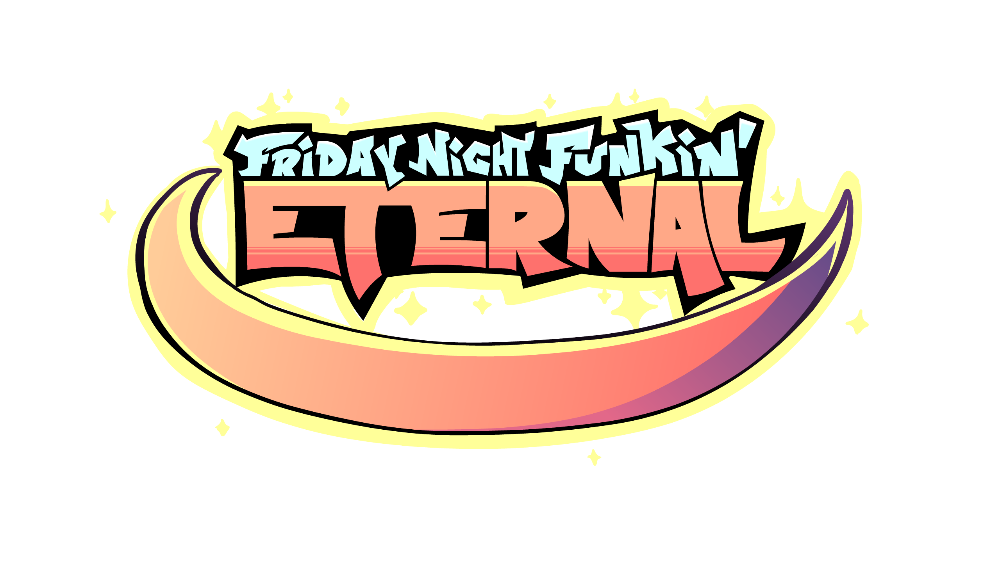

    
    <h1 align="center">Friday Night Funkin': Eternal</h1>
    <h3 align="center">A framework made by modders for modders</h3>

Eternal is an independant [Friday Night Funkin'](https://github.com/FunkinCrew/Funkin) modding framework designed from the ground up, which takes heavy inspiration from the base game to build a unique and performant experience. It aims to be user friendly and easy-to-use while still being extremely moddable.

# Note

- This project is still in development, meaning some features such as dialogue cutscenes are still missing.
- For any questions, don't hesitate to message me on Discord, @sword_352
- Feedback is always appreciated and contributions are welcome!

# Licensing

See the [licensing requirements](LICENSING.md) for more information.

    

        <h2>Features</h2>
    

- Reworked gameplay experience
    - Reworked inputs
        - Fast responsivity
        - Simplified hold notes

    - Reworked user interface
    - New mechanisms
    - Extreme optimisations & top performance

- Full fledged modding API
    - Softcodable components
        - Characters
        - Stages
        - Noteskins
        - Events
        - and more...

    - Dynamic asset system
        - Default assets can be replaced
        - Custom assets can be implemented
        - Multi-extension assets support
            - Allows using multiple extensions for a specific asset type (eg. .ttf and .otf for fonts)
            - Allows replacing a default asset with a custom one using a different file extension

    - Mods menu allowing you to enable/disable/sort mods

- Powerful scripting system
    - Scripting support powered by HScript
    - Event system allowing you to override built-in behaviours
    - Support for many Haxe features
        - Classes
            - Class extensions
            - Custom classes
        - Imports
        - Static variables
        - Iterators
        - `is` keyword
        - 4.3.0 operators
            - `?.` safe navigation operator
            - `??` null coalescing operator
        - and more...

- Simple to use Discord Presence API
- Many options to customize your experience
- A fresh new and efficient crash handler

... and more!

    

        <h2>Building</h2>
    

1. Install the latest version of [Haxe](https://haxe.org/download)
2. Install [git-scm](https://git-scm.com/downloads)
3. Install the required dependencies for your platform (if it is is not listed you can safely skip this):

> Side note: by making a `.haxelib` folder in your installation, all of the librairies to install are going to that folder, so that they won't mess with your already installed ones

    

        <h3>Windows</h3>
    

1. Install the [Visual Studio Build Tools](https://aka.ms/vs/17/release/vs_BuildTools.exe) and wait for the installer to be ready
2. Select the `Individual Components` tab and choose those 2 components:
    * MSVC v143 VS 2022 C++ x64/x86 build tools
    * Windows 10/11 SDK
3. Click on install and wait for the components to be installed, you can safely close the program once finished
4. Run `scripts/setup.bat`

    

        <h3>MacOS</h3>
    

1. Install [Xcode](https://developer.apple.com/xcode/)
2. Run `scripts/setup.sh`

    

        <h3>Linux</h3>
    

1. Install g++ if required:
    - `sudo apt install gcc g++` for Debian-based distros
    - `sudo pacman -S gcc g++` for Arch-based distros
2. Run `scripts/setup.sh`

After those steps, you can build the project with a command prompt by running the appropriate building command for your platform, such as `lime test windows`.

    

        <h2>Credits</h2>
    

Soon!

