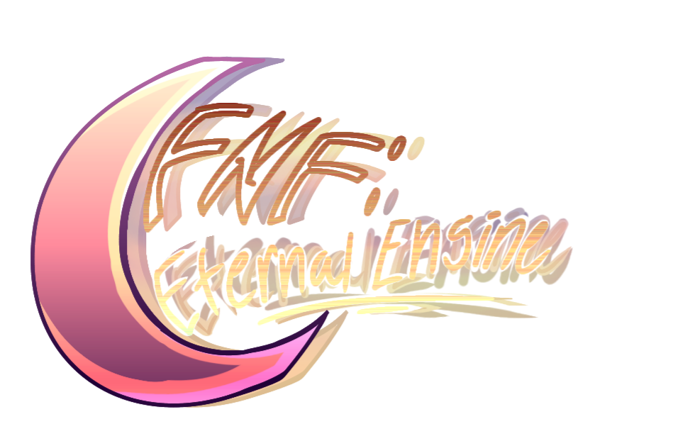

    
    <h1 align="center">Friday Night Funkin': Eternal Engine</h1>

[Friday Night Funkin'](https://github.com/FunkinCrew/Funkin) rewrite and modding engine made from the ground up. Aims to be a beginner-friendly modding framework, for both source and soft modding.

- This project is in **alpha** state, some features such as dialogues are still missing.
- Feedback is always appreciated and contribution is welcome.

## [Compilation Instructions](https://github.com/Sword352/FNF-EternalEngine/blob/master/wiki/COMPILATION.md)
## [Features](https://github.com/Sword352/FNF-EternalEngine/blob/master/wiki/FEATURES.md)

### Credits
> Developers
- Sword: Maintainer, Lead Coder
- Glade: Composer, Minor Coding and Tester
- Moxie: Coder and Tester
- S0ulstive: Artist

> Contributors
- PlankDev: Metronome Sound Composer and Helper Coder
- BlueColorSin: Mods Menu Assets
- ZesCrew2: Loading Screen Asset
- SquidBowl: Animated Few Assets
- Meloomazy: Debug UI Artist, Tester
- SMB: Wiki Writer and Tester
- Swordcube: Helper Coder

> Special Thanks
- Maru: Alphabet Bold Numbers Artist
- Superpowers04: In-Game Crash Handler Concept
- CrowPlexus, EyeDaleHim: Helper, Inspiration
- MAJigsaw77: hxdiscord_rpc and hxvlc Librairies Maintainer
- RapperGF: Helper

> Other Testers
- Crazyb3ndy
- cyn
- TheJutroMan
- Jelly
- leonbrother
- Unholywanderer04
- Daniel (skruyo)